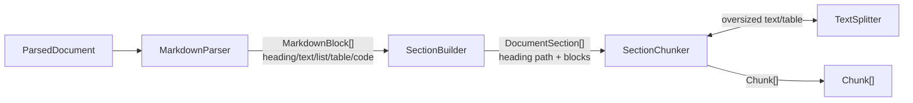

# docquery-chunking

> `ParsedDocument` -> `list[Chunk]`. One of DocQuery's independently versioned pipeline submodules.

## Overview

Takes a [`docquery_core.ParsedDocument`](https://github.com/mohamedabdallah1996/docquery-core)
(ingestion's output) and splits it into header-aware, retrieval-sized
[`docquery_core.Chunk`](https://github.com/mohamedabdallah1996/docquery-core) objects, ready for
embedding. No submodule-to-submodule calls: this package takes input, produces output, nothing
more.

## Tech Stack

| Layer | Technology |
|---|---|
| Language | Python 3.12+ |
| Markdown parsing | markdown-it-py (+ GFM plugin, for tables) |
| Text splitting | langchain-text-splitters |
| Token counting | tiktoken |
| Data contracts | docquery-core (pydantic) |
| Package/dependency management | uv |
| Linting & formatting | Ruff |
| Type checking | mypy (`--strict`) |
| Testing | pytest |

## Architecture



Four stages, each owning one concern:

1. **`MarkdownParser`** -- markdown-it-py's real CommonMark+GFM parser turns each page into typed
   blocks (heading/text/list item/table/code), not regex guesses.
2. **`SectionBuilder`** -- groups blocks under the heading hierarchy, then merges sections too
   small to be useful into the one that follows (a table always keeps its section alive, however
   small).
3. **`SectionChunker`** -- walks each section in order; tables/code become their own chunk(s)
   immediately, consecutive text/list blocks accumulate into a run.
4. **`TextSplitter`** -- splits a text run near `target_tokens` via LangChain's
   `RecursiveCharacterTextSplitter` (tiktoken-backed, paragraph -> line -> sentence -> word,
   recursively); splits an oversized table by row group with the header repeated (no library
   does this -- a row is atomic, unlike a text splitter's separators).

One concrete strategy (`StructureAwareChunker`), no Protocol/base class -- same precedent as
`docquery-ingestion`, revisited if a second strategy shows up. `build_chunker()` is the only way
callers get one.

## Input / Output

**In**: [`docquery_core.ParsedDocument`](https://github.com/mohamedabdallah1996/docquery-core)

| Field | Type | Notes |
|---|---|---|
| `doc_id` | `str` | |
| `pages` | `tuple[ParsedPage, ...]` | each: `page_number: int`, `markdown: str`, `error: str \| None` |
| `status` | `"DONE" \| "PARTIAL" \| "FAILED"` | |

**Out**: `list[docquery_core.Chunk]`

| Field | Type | Notes |
|---|---|---|
| `chunk_id` | `str` | content hash -- deterministic, stable across re-runs |
| `doc_id` | `str` | |
| `page_number` | `int` | source page of the run/block this chunk came from |
| `chunk_type` | `"text" \| "table" \| "list" \| "code"` | never `"image"` -- see note below |
| `section_path` | `tuple[str, ...]` | heading breadcrumb, e.g. `("Intro", "Background")` |
| `content` | `str` | |
| `asset_ref` | `str \| None` | always `None` here -- no image chunks produced |
| `parent_chunk_id` | `str \| None` | hash of `doc_id` + `section_path`, ties sibling chunks together |

`chunk_type="image"` is a valid value in the shared `Chunk` contract but this chunker never
produces it -- v0 resolved image chunks against a separate captioning stage that doesn't exist in
this pipeline (GLM-OCR does no image captioning), so image blocks are dropped rather than emitted
empty.

## Project Structure

```
src/docquery_chunking/
  chunker.py                 # StructureAwareChunker -- the only concrete strategy today
  config.py                     # ChunkingConfig
  factory.py                       # build_chunker() -- resolves config -> a ready chunker
  models.py                          # MarkdownBlock, DocumentSection (internal, not exchanged)
  utils.py                              # count_tokens, stable_id
  components/
    markdown_parser.py                    # ParsedDocument -> MarkdownBlocks
    section_builder.py                       # MarkdownBlocks -> DocumentSections
    section_chunker.py                          # DocumentSection -> Chunks
    text_splitter.py                               # size-bounded text/table splitting
tests/                                               # end-to-end behavioral tests
```

## Getting Started

### Prerequisites

- Python 3.12+
- [uv](https://docs.astral.sh/uv/)

### Installation

```bash
git clone https://github.com/mohamedabdallah1996/docquery-chunking
cd docquery-chunking
uv sync
```

### Using it

```python
from docquery_chunking import build_chunker

chunker = build_chunker({"chunking": {"target_tokens": 500, "min_section_tokens": 30}})
chunks = chunker.chunk(parsed_document)
```

`docquery-core` is depended on via a git source (`[tool.uv.sources]`), not a local path -- this
package's own checkout has no sibling `docquery-core` directory to point a path at. The
orchestrator overrides this the same way for its own reasons; see
[`docquery`'s README](https://github.com/mohamedabdallah1996/DocQuery) for that side of it.

## Testing

```bash
uv run pytest
```

### End-to-end demo

`chunker.py` has a `main()` that runs the chunker over a small but challenging document (nested
headings, a mergeable section, an atomic table, an oversized table, a list, a code fence, an
oversized paragraph) and prints every resulting chunk:

```bash
uv run python -m docquery_chunking.chunker
```

## Development

```bash
uv run ruff check .
uv run ruff format .
uv run mypy src
```
